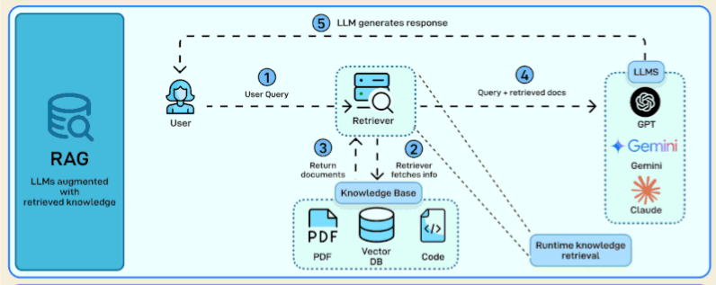
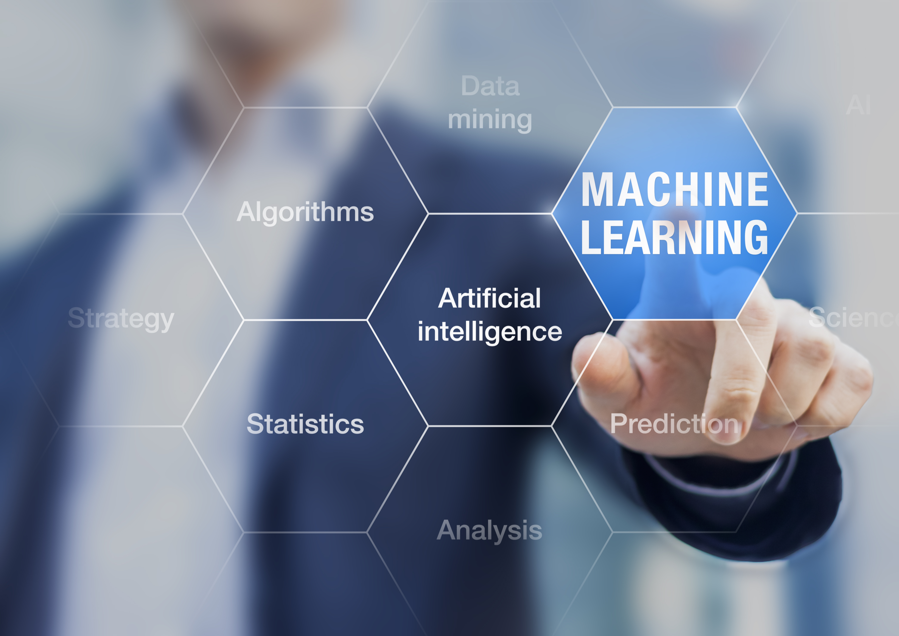

# SIVAMANI PORTFOLIO

# PROJECTS

## 01. Generative AI Query Agent 

A **streaming ReAct-based AI agent** designed to answer Arduino-related questions using grounded knowledge retrieval. The system combines agent orchestration, LLM reasoning, persistent conversational state, and a FastAPI backend into an end-to-end AI workflow.

**Key Technologies:** `Python` `LangGraph` `ReAct` `Gemini` `FastAPI` `PostgreSQL` `AsyncPG` `JWT` `Docker`

**Highlights**

- Implemented a **LangGraph ReAct agent** for tool-driven reasoning.
- Added **streaming responses** through FastAPI.
- Implemented persistent conversational state with PostgreSQL-backed checkpoints.
- Connected retrieval with generation to keep responses grounded in available knowledge.
- Structured the project around reusable backend components.

  

---

## 02. Information Retrieval using RAG

A **Retrieval-Augmented Generation system** focused on retrieving relevant information from a document corpus before generating an answer. The project demonstrates the core RAG pipeline from document processing and embeddings to semantic retrieval and grounded generation.

**Key Technologies:** `Python` `RAG` `Embeddings` `Vector Search` `LLMs`

**Highlights**

- Structured the pipeline around **document ingestion, chunking, embedding, retrieval, and generation**.
- Explored semantic retrieval to identify relevant context before generation.
- Designed the workflow around grounding LLM responses in retrieved information.
- Provides a foundation for knowledge-based AI applications.

---

## 03. Backend System for ML Model Serving using FastAPI

A backend engineering project that converts machine-learning workflows into **reusable REST APIs** using FastAPI. The system focuses on model training, validation, persistence, and inference through a consistent API layer.

**Key Technologies:** `Python` `FastAPI` `Scikit-learn` `Pydantic` `Pandas` `NumPy` `Joblib` `Docker`

**Highlights**

- Converted **7 machine-learning workflows** into API-driven services.
- Implemented `/health`, `/train`, and `/predict` endpoints.
- Used **Scikit-learn Pipelines** to combine preprocessing and model inference.
- Added model persistence using Joblib.
- Added request validation with Pydantic.
- Containerized the backend with Docker.

---

## 04. Image Caption Generator

An **image-to-text deep learning system** that combines convolutional visual feature extraction with recurrent language generation. The model learns to transform image representations into natural-language captions.

**Key Technologies:** `Python` `TensorFlow` `Keras` `VGG16` `CNN` `LSTM` `NLP`

**Dataset:** `Flickr8k` • `8,091 images` • `~40,455 captions`

**Highlights**

- Used pretrained **VGG16** for visual feature extraction.
- Generated **4,096-dimensional image feature vectors**.
- Built an LSTM sequence-generation pipeline.
- Created image-caption training pairs for supervised learning.
- Used categorical cross-entropy with Adam optimization.
- Implemented greedy decoding with repetition prevention.

---

## 05. AI-Powered Email Spam Detection

An **NLP-based classification system** that separates spam and legitimate emails through text preprocessing, feature extraction, supervised learning, and reusable model inference.

**Key Technologies:** `Python` `Pandas` `NLTK` `Scikit-learn` `CountVectorizer` `Multinomial Naive Bayes`

**Highlights**

- Built reproducible text preprocessing using regex cleaning, stopword removal, and lemmatization.
- Converted text into a **3,500-feature Bag-of-Words representation**.
- Trained a Multinomial Naive Bayes classifier.
- Serialized the trained model and vectorizer for reusable inference.
- Reported **98% test accuracy** and **0.91 F1-score** on the spam class.

---

## 06. Multi-Agent AI Customer Support System

A **multi-agent customer-support workflow** that routes user queries to specialized capabilities for order information, product information, and FAQ retrieval. A manager agent coordinates the overall workflow.

**Key Technologies:** `Langflow` `OpenAI GPT` `NVIDIA Embeddings` `Astra DB` `Python` `Streamlit` `RAG`

**Highlights**

- Designed specialized agents for different support tasks.
- Added a manager layer for **query routing and agent coordination**.
- Combined structured database access with document-based RAG.
- Used Astra DB for vector search and semantic retrieval.
- Integrated the workflow with a Streamlit interface and API endpoints.

---

## 07. AI Research Agent using Python

A **tool-using AI research agent** that combines LLM reasoning with external information-retrieval tools. The agent determines when tools such as Wikipedia and DuckDuckGo are useful and returns structured research results.

**Key Technologies:** `Python` `LangChain` `LLMs` `Wikipedia` `DuckDuckGo` `Pydantic`

**Highlights**

- Implemented tool-aware LLM workflows.
- Connected model reasoning with external information retrieval.
- Used Pydantic for structured outputs.
- Produced research summaries containing topic information, sources, and tools used.
- Persisted research outputs to timestamped text files.

---

## 08. NYC Taxi Record Analysis

A large-scale **exploratory data analysis project** using NYC taxi trip records to uncover demand patterns, pickup behaviour, payment preferences, trip characteristics, and operational trends.

**Key Technologies:** `Python` `Pandas` `NumPy` `Matplotlib` `Seaborn` `SQL`

**Dataset Scale:** `2M+ records`

**Highlights**

- Analysed **2M+ taxi trip records**.
- Identified and removed approximately **8% anomalies** during data cleaning.
- Found **6 PM** as the busiest pickup hour with approximately **199K trips**.
- Identified Wednesday as the busiest day with approximately **463K trips**.
- Found approximately **82% of riders used credit cards**.
- Converted analytical findings into practical operational recommendations.

---

